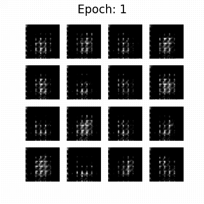

# Wasserstein GANs

This repository contains some code for demonstrating the application of Wasserstein GANs (WGANs). The code is used in the following blog posts:

* [Wasserstein GANs](https://www.fabriziomusacchio.com/blog/2023-07-29-wgan/)

For further details, please refer to these posts.

Results of traning a default GAN on the MNIST dataset for 50 epochs:


Results of traning a Wasserstein GAN on the same dataset:


For reproducibility:

```powershell
conda create -n gan -y python=3.9
conda activate gan
conda install mamba -y
mamba install -y numpy matplotlib scikit-learn scipy pot tensorflow imageio pillow ipykernel
mamba install -y pytorch torchvision -c pytorch
pip install POT
```

If you want to run the code on a Mac with Apple Silicon (M1, M2), install tensorflow and pytorch as described here:


* [How to run TensorFlow on the M1 Mac GPU](https://www.fabriziomusacchio.com/blog/2022-11-10-apple_silicon_and_tensorflow/)
* [How to run PyTorch on the M1 Mac GPU](https://www.fabriziomusacchio.com/blog/2022-11-18-apple_silicon_and_pytorch/)


